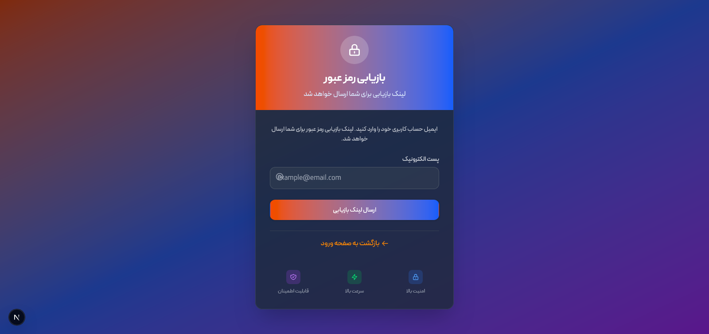
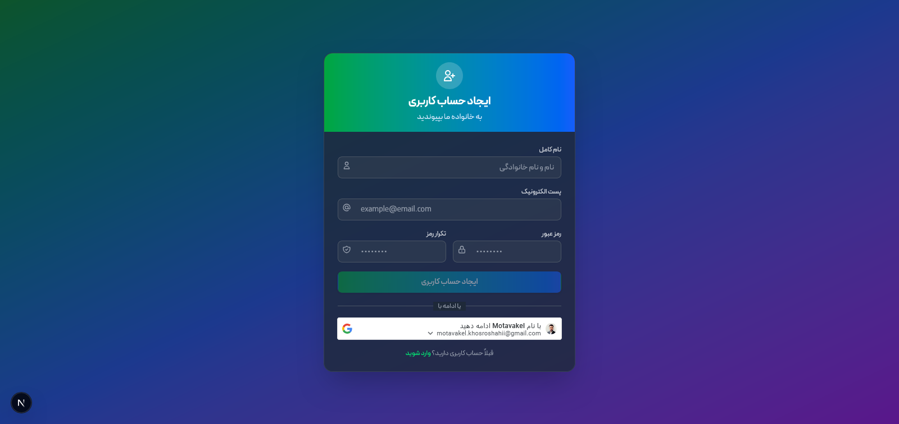
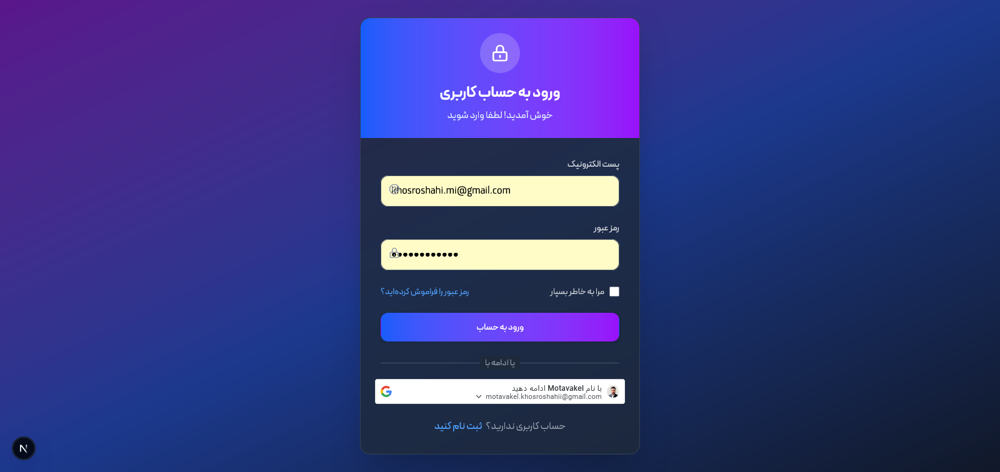
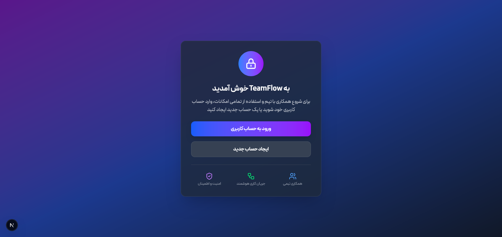

### وب اپلیکیشن هوشمند چت تیمی TeamFlow

<p align="center">
  
  
</p>
<p align="center">
  
  
</p>
<p align="center">
  
  
</p>

## معرفی برنامه

<p align="justify">
وب اپلیکیشن TeamFlow یک برنامه چت آنلاین فول استک است که به‌طور خاص برای ارتباطات تیمی و شخصی بلادرنگ (Real-Time طراحی شده است. این اپلیکیشن با ترکیب فناوری‌های مدرن، تجربه‌ای سریع، امن و هوشمند مشابه Slack را برای کاربران فراهم می‌کند. این پلتفرم با استفاده از OAuth2 برای احراز هویت، Zustand برای مدیریت استیت، و Socket.IO برای ارتباط بلادرنگ، تجربه‌ای پایدار، سریع و در عین حال سبک در ارتباطات کاربر به کاربر فراهم می‌کند. همچنین، با Dockerization کامل در بخش‌های Frontend، Backend، Database و WebSocket Server، استقرار و مقیاس‌پذیری سیستم به‌صورت یکپارچه و کارآمد انجام می‌شود. 

### ویژگی هوشمند (AI Powered) ویژگی برجسته TeamFlow
<p align="justify">
تیم فلو با استفاده از هوش مصنوعی DeepSeek  قابلیت‌های مهمی را ارائه می‌دهد و بهره‌وری ارتباطات تیمی را به شکل چشمگیری افزایش می‌دهد:

  - خلاصه‌سازی مکالمات: دریافت خلاصه مختصر از مکالمات طولانی.
  - پیشنهاد پاسخ‌های هوشمند: پیشنهاد پاسخ‌های مرتبط و متناسب با Context مکالمه.

## فناوری‌های استفاده شده

### Frontend
- Next.js 14 (App Router + Server Components)
- TypeScript
- Tailwind CSS
- Zustand
- Socket.IO Client
- PWA Support

### Backend
- Node.js + Express
- TypeScript
- MongoDB + Mongoose
- Socket.IO
- OAuth2 (JWT Access + Refresh Token)
- DeepSeek AI API

### DevOps
- Docker + Docker Compose (Frontend, Backend, MongoDB, Socket Server)
- ESLint + Prettier
- محیط کاملاً Dockerized و آماده Production

##  ویژگی‌های کلیدی

- ایجاد ورک‌اسپیس اختصاصی و کانال‌های متعدد
- چت بلادرنگ (Real-Time) با Socket.IO
- نمایش وضعیت آنلاین/آفلاین کاربران
- احراز هویت امن با OAuth2 + Refresh Token
- پشتیبانی کامل PWA (نصب روی موبایل و دسکتاپ)
- حالت دارک/لایت اتوماتیک
- مدیریت کامل اعضای ورک‌اسپیس و لینک دعوت
- هوش مصنوعی DeepSeek:
  - خلاصه‌سازی مکالمات طولانی
  - پیشنهاد پاسخ‌های هوشمند بر اساس Context

## ساختار پروژه

```tree
TeamFlow/
├── frontend/
│   ├── .next/                 
│   ├── node_modules/
│   ├── public/
│   │   ├── manifest.json      
│   │   └── icons/              
│   ├── src/
│   │   ├── app/
│   │   │   ├── (auth)/
│   │   │   │   ├── login/
│   │   │   │   │   └── page.tsx
│   │   │   │   ├── register/
│   │   │   │   │   └── page.tsx
│   │   │   │   ├── forget-password/
│   │   │   │   │   └── page.tsx
│   │   │   │   └── layout.tsx
│   │   │   ├── (workspace)/
│   │   │   │   ├── page.tsx
│   │   │   │   └── layout.tsx
│   │   │   └── globals.css
│   │   ├── components/
│   │   │   ├── common/
│   │   │   │   ├── Button.tsx
│   │   │   │   ├── CopyToClipboard.tsx
│   │   │   │   ├── Portal.tsx
│   │   │   │   ├── Modal.tsx
│   │   │   │   └── Input.tsx
│   │   │   ├── layout/
│   │   │   │   ├── Sidebar.tsx
│   │   │   │   └── ChatView.tsx
│   │   │   ├── channel/
│   │   │   │   └── CreateChannelModal.tsx
│   │   │   ├── workspace/
│   │   │   │   ├── CreateWorkspaceModal.tsx
│   │   │   │   ├── WorkspaceMenu.tsx
│   │   │   │   └── WorkspaceManager.tsx
│   │   │   └── chat/
│   │   │       ├── Message.tsx
│   │   │       ├── MessageInput.tsx
│   │   │       ├── MessageList.tsx
│   │   │       └── AISuggestions.tsx
│   │   ├── hooks/
│   │   │   ├── useAuth.ts
│   │   │   ├── useAIChatFeatures.ts
│   │   │   └── useChatState.ts
│   │   ├── services/
│   │   │   ├── api.ts
│   │   │   └── socket.ts
│   │   ├── styles/
│   │   │   └── globals.css
│   │   └── types/
│   │       └── index.ts
│   ├── .eslintrc.json
│   ├── next.config.js
│   ├── package.json
    └── tsconfig.json
│
├── backend/
│   ├── src/
│   │   ├── db.ts
│   │   ├── index.ts
│   │   ├── controllers/
│   │   │   ├── authController.ts
│   │   │   ├── groupController.ts
│   │   │   ├── userController.ts
│   │   │   └── messageController.ts
│   │   ├── middleware/
│   │   │   ├── authMiddleware.ts
│   │   │   └── errorMiddleware.ts
│   │   ├── validators/
|   |   |    ├── authValidator.ts
|   |   |    └── messageValidator.ts
│   │   ├── models/
│   │   │   ├── User.ts
│   │   │   ├── Group.ts
│   │   │   ├── Channel.ts
│   │   │   └── Message.ts
│   │   ├── routes/
│   │   │   ├── authRoutes.ts
│   │   │   ├── groupRoutes.ts
│   │   │   ├── userRoutes.ts
│   │   │   ├── messageRoutes.ts
│   │   │   └── index.ts
│   │   ├── services/
│   │   │   └── socketService.ts
│   │   └── utils/
│   │       └── generateToken.ts
│   ├── .env
│   ├── package.json
│   └── server.ts
│
├── docker-compose.yml
├── .gitignore
├── .env.example
└── README.md
