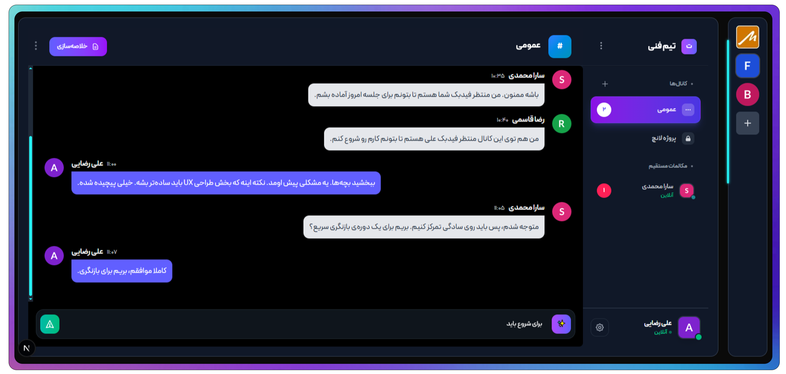

#  وب اپلیکیشن هوشمند TeamFlow

## معرفی برنامه

وب اپلیکیشن TeamFlow یک برنامه چت آنلاین فول استک است که به‌طور خاص برای **ارتباطات تیمی و شخصی بلادرنگ (Real-Time)** طراحی شده است. این اپلیکیشن با ترکیب فناوری‌های مدرن، تجربه‌ای سریع، امن و هوشمند مشابه Slack را برای کاربران فراهم می‌کند.

این پلتفرم با استفاده از OAuth2 برای احراز هویت، Zustand برای مدیریت استیت، و Socket.IO برای ارتباط بلادرنگ، تجربه‌ای پایدار، سریع و در عین حال سبک در ارتباطات کاربر به کاربر فراهم می‌کند.
همچنین، با Dockerization کامل در بخش‌های Frontend، Backend، Database و WebSocket Server، استقرار و مقیاس‌پذیری سیستم به‌صورت یکپارچه و کارآمد انجام می‌شود.

###  ویژگی هوشمند (AI Powered)

ویژگی برجسته TeamFlow، یکپارچه‌سازی هوش مصنوعی **DeepSeek** است که قابلیت‌های زیر را ارائه می‌دهد و بهره‌وری ارتباطات تیمی را به شکل چشمگیری افزایش می‌دهد:

* **خلاصه‌سازی مکالمات:** دریافت خلاصه مختصر از مکالمات طولانی.
* **پیشنهاد پاسخ‌های هوشمند:** پیشنهاد پاسخ‌های مرتبط و متناسب با Context مکالمه.

---

## معماری فنی

معماری TeamFlow بر اساس یک معماری مدرن و مجزا (Decoupled) بنا شده است:

### بخش سمت سرور (Backend)

- **بک اند Node.js**: محیط اجرایی (Runtime) برای پردازش درخواست‌ها و اجرای منطق سمت سرور  
- **کتابخانه Express**: فریم‌ورک سریع و مینیمال برای ساخت APIهای RESTful  
- **دیتابیس MongoDB**: پایگاه داده‌ی NoSQL با ساختار انعطاف‌پذیر برای ذخیره داده‌ها  
- **وب سوکت Socket.IO**: مدیریت ارتباطات بلادرنگ (Real-Time Communication) بین کلاینت و سرور  
- **احراز هویت OAuth2**: سیستم احراز هویت امن با پشتیبانی از Access و Refresh Token  

---

###  بخش سمت فرانت‌اند (Frontend)

- **فرانت Next.js**: فریم‌ورک React با پشتیبانی از SSR و SSG برای بهبود عملکرد و سئو  
- **کدنویسی با TypeScript**: افزودن تایپ استاتیک برای افزایش کیفیت و پایداری کد  
- **کنترل وضعیت با Zustand**: ابزار سبک و سریع برای مدیریت استیت در برنامه‌های React  
- **استایل Tailwind CSS**: فریم‌ورک CSS مدرن برای طراحی سریع و واکنش‌گرا  
- **ارتباط Socket.IO**: ایجاد ارتباط بلادرنگ بین کاربران در سمت فرانت  

---

## ویژگی‌های اصلی

* ** ایجاد ورک اسپیس اختصاصی:** امکان ایجاد محیط کاری، تعریف کانال‌های مختلف و ارسال لینک دعوت.
* ** چت آنلاین آنی:** ارسال و دریافت پیام‌ها به‌صورت بلادرنگ (Real-Time).
* ** حالت آفلاین و آنلاین:** نمایش وضعیت لحظه‌ای آنلاین یا آفلاین کاربران.
* ** مدیریت کاربران با OAuth2:** احراز هویت امن و مدیریت دسترسی‌ها.
* ** مدیریت استیت با Zustand:** ذخیره‌سازی و به‌روزرسانی بهینه استیت‌های برنامه.
* ** پشتیبانی از PWA:** نصب آسان اپلیکیشن بر روی دستگاه‌های موبایل و دسکتاپ.

---

## قابلیت‌های هوشمند (DeepSeek AI)

این ویژگی‌ها TeamFlow را به یک دستیار هوشمند تبدیل می‌کند:

* **خلاصه‌سازی مکالمات** : فشرده‌سازی محتوای مکالمات طولانی با حفظ مفهوم اصلی. کاربردی برای کانال‌های پرترافیک. 
* **پیشنهاد پاسخ‌های هوشمند** : تحلیل آخرین پیام و پیشنهاد پاسخ‌های متناسب با Context مکالمه.
